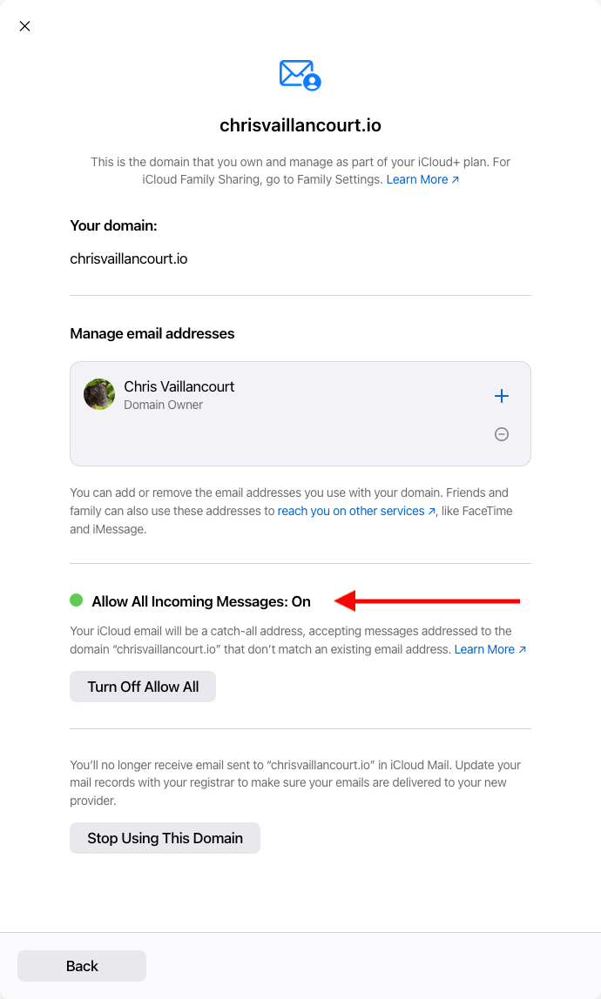

## What's a custom email domain?

A custom email domain is the part of the email address after the `@` character.
If our email address is `example@gmail.com`, the email domain is the
`@gmail.com` part.

## Why a custom email domain?

### Curate your professional "brand"

Using your own email domain makes you stand out from others. As a tech
professional, having your own email domain shows you care about your
professional "brand" and know a little something about DNS.

### Find out who's selling your data

With a custom email domain, you can use a different email addresses for each
service you sign up for. This works by
[configuring your email address to be a catch-all address](#configuring-a-catch-all-email-address).

For example, when signing up for Wikipedia, I may sign up with the email
`wikipedia@my-awesome-domain.com`.

Then, if I (hypothetically) receive spam to my `wikipedia@my-awesome-domain.com`
account, it's easy to determine Wikipedia sold my data.

### Have control over your email

With a custom email domain, you're in control of your email. This allows you to
move freely between email hosts while keeping the same email address.

If Apple does something I don't like, I can freely move to a different host by
changing my DNS settings. My email address stays the same so I don't need to
migrate my accounts to a new email address.

If I were to use an `@gmail.com` email, then I'm stuck using gmail forever. The
only way to get away from gmail is to create a different email address on
another service.

## How to configure a custom email domain

### What you need

You need a domain (I use
[Cloudflare](https://www.cloudflare.com/products/registrar/)) and an email host.
[iCloud+](https://support.apple.com/en-us/HT201238) includes
[custom email domains](https://support.apple.com/en-us/HT212514) with your
iCloud+ subscription. With this approach, your email us hosted with iCloud mail.

## Configuring DNS

Apple has thorough
[docs on adding a custom email domain to your iCloud account](https://support.apple.com/guide/icloud/add-a-domain-you-own-mma473945269/icloud).
I won't walk through the setup step by step but I will show how to configure
your DNS with Cloudflare.

### The problem with iCloud's email DNS config

The tricky part of this setup was the way iCloud configures your CNAME DNS
record. I use [Cloudflare Pages](https://pages.cloudflare.com/) to host this
site so I already had two CNAME records in my DNS settings:

During the iCloud email domain setup, they wanted to make changes to my DNS
records, specifically removing my chrisvaillancourt.io CNAME record 😮:

With iCloud's configuration, I wouldn't be able to access this site with
[chrisvaillancourt.io](https://chrisvaillancourt.io/) 😞.

### Fixing iCloud's email DNS config

The iCloud setup doesn't provide a mechanism to pick and choose which records to
add so we have to accept their config to complete the setup.

With these DNS records, I could receive and send email with my
`@chrisvaillancourt.io` domain 🥳 but I couldn't navigate to this website at
[chrisvaillancourt.io](https://chrisvaillancourt.io/) 😭.

Thankfully, we aren't stuck with our new DNS configuration. All we need to do is
add back the CNAME record that iCloud removed during the email DNS setup:

I'm not sure why iCloud does this but I haven't had any DNS issues after adding
back the original CNAME record.

## Configuring a catch-all email address

iCloud allows you to configure a "catch-all" email address for your new email
domain. This allows us to have as many email addresses as we want for our email
domain.

To do this, navigate to the
[iCloud+ Features page](https://www.icloud.com/icloudplus/). Then, click on the
"Custom Email Domain" card:

Click on the card and select the domain:

Then, select the option to "Allow All Incoming Messages":

Now you'll receive any email sent to your email domain 🚀.
