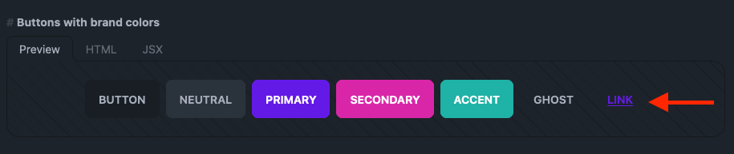
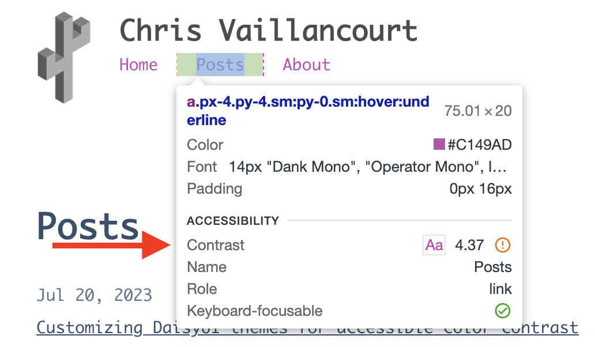
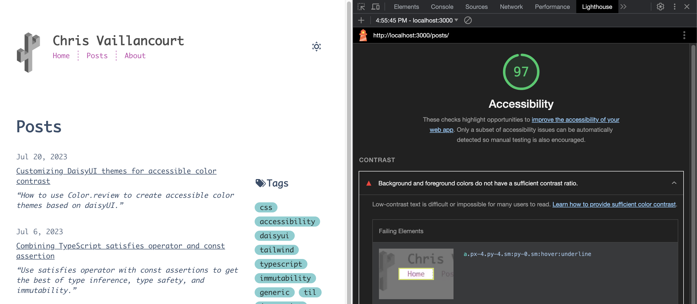
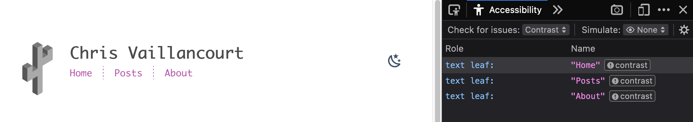
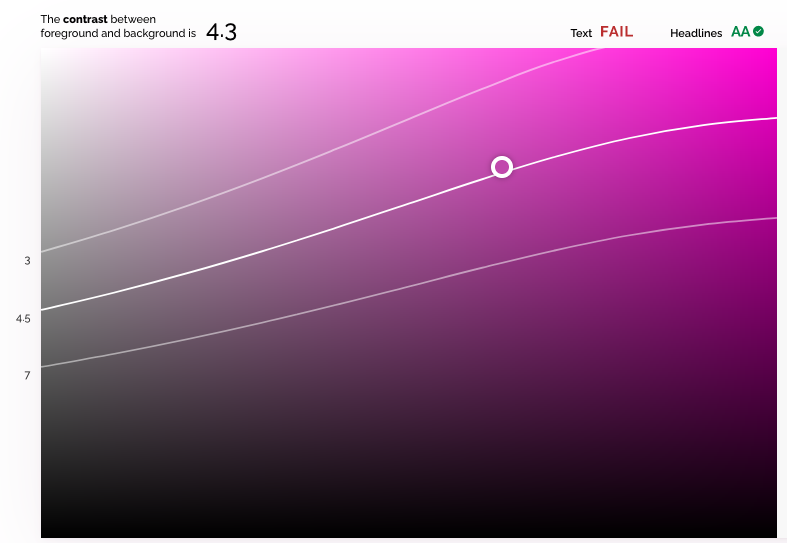
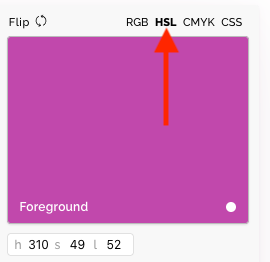
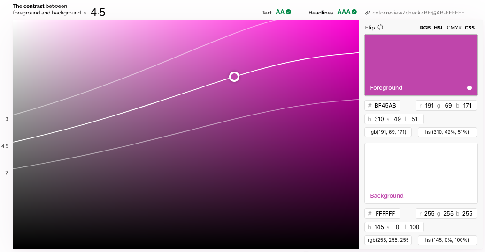
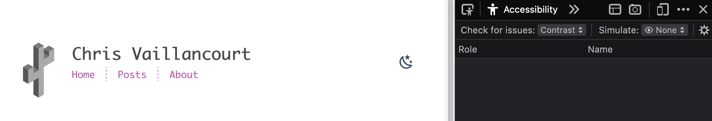

## TLDR

Use [Color.review](https://color.review/) with automated accessibility tools
like Firefox accessibility checker to create accessible daisyUI themes.

## What is daisyUI?

[daisyUI](https://daisyui.com/) is a fantastic component library based on
[tailwind](https://tailwindcss.com/). I like using it with tailwind because it
allows us to replace long, indecipherable strings of tailwind classes with
semantic component class names.

For example, to style a button with tailwind, you'd write:

```html
<button
	class="focus-visible:ring-offset-2 inline-block cursor-pointer rounded-md bg-indigo-600 px-4 py-3 text-center text-sm font-semibold uppercase text-white transition duration-200 ease-in-out hover:bg-indigo-700 focus-visible:outline-none focus-visible:ring-2 focus-visible:ring-indigo-600 active:scale-95"
>
	Tailwind Button
</button>
```

With daisyUI, you'd write:

```html
<button class="btn btn-primary">daisyUI Button</button>
```

daisyUI doesn't entirely replace tailwind, but it does improve the developer
experience of creating [common components](https://daisyui.com/components/).

## daisyUI themes

daisyUI also comes with 20+ [themes](https://daisyui.com/docs/themes/) which
help us create consistent styles across its components. We can leverage the
selected theme colors with
[semantic color class utilities](https://daisyui.com/docs/colors/) like
`text-primary` or `bg-accent`.

## The challenge with daisyUI themes

As wonderful as they are, daisyUI's themes have a hidden challenge: accessible
color contrast.

I first noticed it while browsing the
[button component docs](https://daisyui.com/components/button/). My operating
system theme preference is dark so the docs default to the "dark" theme. I love
this but noticed the link button has dark purple text and a dark gray
background:



It feels too washed out, even as someone with no vision deficiencies. I figured
this was minor and isolated to this specific instance.

I was wrong.

[Outline badges](https://daisyui.com/components/badge/#outline-badge),
[chat bubbles with color](https://daisyui.com/components/chat/#chat-bubble-with-colors),
accent text (i.e. `<p class="text-accent">Accent text</p>`), and
[primary color links](https://daisyui.com/components/link/#primary-color) all
have insufficient color contrast. And that's only with the dark theme.

The [daisyUI doc page on colors](https://daisyui.com/docs/colors/) doesn't
mention anything about accessibility either 🤔.

I jumped into daisyUI's issues, thinking I must've missed something in the docs
about accessibility. Or maybe I needed to add a modifier to my class names to
use a lighter or darker version of the color (i.e.
[Vuetify's material colors with lighten and darken modifiers](https://vuetifyjs.com/en/styles/colors/#material-colors))?

Searching for
[issues that include "accessibility"](https://github.com/saadeghi/daisyui/issues?q=is%3Aissue+accessibility)
shows I wasn't the first to run into this. Issues
[#1174](https://github.com/saadeghi/daisyui/issues/1174) and
[#1415](https://github.com/saadeghi/daisyui/issues/1415) reveal we're on our own
when it comes to creating components with accessible color contrast.

_Side note_: I understand why it's this way. This is free software and
[Pouya](https://github.com/saadeghi) is a saint for giving us daisyUI. I
genuinely appreciate the time and effort that's gone into building daisyUI.

## Diagnosing accessibility issues

Despite these issues, there is a path forward. Most browsers ship with
accessibility tools built into the dev tools. There's even a
[W3C page with 100+ tools for automating accessibility testing](https://www.w3.org/WAI/ER/tools/).

Chrome shows accessibility issues when inspecting elements with insufficient
color contrast:



Chrome's lighthouse also has accessibility tests which makes it easy to find
accessibility issues for the entire page:



Firefox also has an
[Accessibility Inspector](https://firefox-source-docs.mozilla.org/devtools-user/accessibility_inspector/)
in its dev tools so we aren't limited to Chrome.

Here's the result of running Firefox's accessibility inspector on the
[posts page](/posts):



## Finding the problematic theme color

Once we have a daisyUI theme and a tool to find accessibility issues, we're
ready to start. I'll use the "winter" theme and
[Firefox's accessibility checker](https://firefox-source-docs.mozilla.org/devtools-user/accessibility_inspector/#check-for-accessibility-issues).

Looking at the accessibility reports, we see three text elements with contrast
issues caused by the pink text on a white background. The text color comes from
the `class="text-accent"` snippet:

```html
<nav class="text-accent">
	<!-- irrelevant code omitted -->
</nav>
```

Initially, we set the daisyUI theme in our `tailwind.config.ts` (or `.js`) with
a string matching the name of a
[daisyUI theme](https://daisyui.com/docs/themes/):

```ts
export default {
	// other config omitted
	daisyui: {
		themes: ['winter'], // or whatever themes you want
	},
};
```

Instead, we need to import our theme so we can selectively override the
problematic color:

```ts
import daisyuiThemes from 'daisyui/src/theming/themes';
// other tailwind imports omitted
export default {
	// other config omitted
	daisyui: {
		themes: [
			{
				winter: {
					// shallow copy winter theme properties
					...daisyuiThemes[`[data-theme=winter]`],
					// custom color for `accent` property
					accent: '', // We'll add this next
				},
			},
		],
	},
};
```

If we view the imported `daisyuiThemes` object, we can see the following object:

```js
{
  // other themes omitted
  "[data-theme=winter]": {
    "color-scheme": "light",
    "primary": "#047AFF",
    "secondary": "#463AA2",
    "accent": "#C148AC",
    "neutral": "#021431",
    "base-100": "#ffffff",
    "base-200": "#F2F7FF",
    "base-300": "#E3E9F4",
    "base-content": "#394E6A",
    "info": "#93E7FB",
    "success": "#81CFD1",
    "warning": "#EFD7BB",
    "error": "#E58B8B",
  },
}
```

Since the class that's causing the issue is `text-accent`, we know (see the
[daisyUI docs on how to use colors with utility classes](https://daisyui.com/docs/colors/#-3))
we need to change the `accent` property so it's darker on the white background.

I prefer using [Color.review](https://color.review/) to find accessible colors.
The thing that separates it from other tools is the way it visually represents
the three WCAG standards for color contrast for a given color. It does this by
drawing lines across the across the 2D color space for each of the three
recommended contrast ratios. For example, the three white lines show the
accessibility cutoff for the default accent color `"#C148AC"` on a white
background:



To meet the AA WCAG guidelines, we need a contrast ratio of:

- 4.5 for text (i.e. paragraph text)
- 3 for headlines, large text, and other inactive interface elements (controls,
  buttons, loading indicators, etc.)

With this visualization, we can tell the "winter" theme's accent color has a 4.3
contrast ration with a white background. This passes the AA minimum ratio of 3
for headlines and large text but fails the 4.5 ratio for smaller text.

Since the nav links in question fall into the small text category, we know we
need to bump the contrast level up a little to meet the 4.5 standard.

The easiest way to get there is to toggle the HSL (H: hue, S: saturation, and L:
lightness) color mode above the foreground color input. With that toggled, we
see the accent hex color code converted from `#C148AC` to h: 310, s: 49, and
l: 52.



One easy way for us to increase the contrast with the white background is to
decrease the lightness number until we hit 4.5. Dropping the lightness from the
52% (default) to 51% does the trick:



Next, we need to copy the hex code for the modified color (`"#BF45AB"`) since
that's what the daisyUI theme config expects:

```ts
import daisyuiThemes from 'daisyui/src/theming/themes';
// other tailwind imports omitted
export default {
	// other config omitted
	daisyui: {
		themes: [
			{
				winter: {
					// shallow copy default winter theme properties
					...daisyuiThemes[`[data-theme=winter]`],
					// custom color for `accent` property
					accent: '#BF45AB',
				},
			},
		],
	},
};
```

Rerun Firefox's accessibility checker and voila! No more color contrast issues:



See my
[theme module in Github](https://github.com/chrisvaillancourt/website/blob/64036b7bc4f33d34c2c98243c8265b029f9aa967/src/lib/theme.ts)
for the actual implementation.
