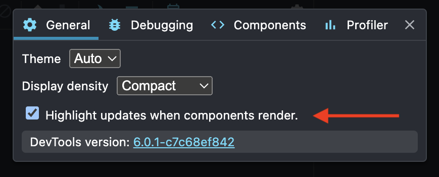

## TLDR

Variables/functions defined in the function body of a component are re-created
on every render. Anything that receives them as props will re-render every time,
even if the component is memoized with `memo()`. Memoize objects and functions
passed as props with
[`useMemo()`](https://react.dev/reference/react/useMemo)/[`useCallback()`](https://react.dev/reference/react/useCallback)
and memoize components with [`memo()`](https://react.dev/reference/react/memo)
to prevent unnecessary re-renders.

## Why React re-renders

By default, React re-renders a component whenever:

1. props changed
1. a component higher in the component tree re-rendered
1. state changed
1. context changed

React doesn't have
[fine-grained reactivity (💛 solid )](https://docs.solidjs.com/advanced-concepts/fine-grained-reactivity#fine-grained-reactivity)
so it has to re-render a component to find out what (if anything) needs to
change in the UI. An unnecessary re-render is a re-render that occurs, even
though a component's props or state haven't changed in a way that affects the
UI.

## Why is re-rendering a problem?

Extra re-renders are _usually_ okay! A lot of devs like the simplicity of the
React system.

Problems appear if you're unnecessarily re-rendering:

1. large swaths of your app
1. Computationally expensive components

When these types of re-renders happen, users experience:

- slow, janky UIs
- sub 60fps animations
- delayed user interaction
- hot laptops and dead batteries

## A common source of re-renders: hidden prop changes

A common source of unnecessary re-renders is 'hidden' prop changes. This happens
when we pass props that appear to be the same to us but aren't the same to
React.

In the following app structure, when do you expect `<List/>` to re-render?

```tsx
export default function App() {
	const [name, setName] = useState('');
	const items = ['a', 'b', 'c'];

	return (
		<>
			<Input value={name} onChange={setName} />
			<List items={items} />
		</>
	);
}

const List = memo(function List({ items }: { items: string[] }) {
	return (
		<ul>
			{items.map((item) => (
				<li key={item}>{item}</li>
			))}
		</ul>
	);
});

function Input({
	value,
	onChange,
}: {
	value: string;
	onChange: (str: string) => void;
}) {
	return (
		<>
			<label htmlFor="name">Name: </label>
			<input
				type="text"
				value={value}
				id="name"
				onChange={(e) => onChange(e.target.value)}
			/>
		</>
	);
}
```

`<List />` re-renders whenever someone types into the input. We memoized it with
`memo()` so it should only re-render when its props/state change, right? 🧐

In this case, typing triggers `setName()` which causes `<App />` to re-render.
We're defining `items` in the function body of `App()` so we're creating a new
`items` array every time `<App />`'s state updates. From `<List/>`'s
perspective, it's getting a separate array every time.

## To re-render or not to re-render

Why does defining data in the body of a component cause re-renders?
[React uses `Object.is()`](https://react.dev/reference/react/memo#minimizing-props-changes)
to compare old props with new props. If they're different, React re-renders.

From `<List />`'s perspective, it sees:

```js
Object.is(['a', 'b', 'c'], ['a', 'b', 'c']); // false 😔
```

[`Object.is()`](https://developer.mozilla.org/en-US/docs/Web/JavaScript/Reference/Global_Objects/Object/is)
uses referential equality for Objects/functions. That means both
objects/functions need to point to the same location in memory in order to
evaluate to `true`. Since we're creating a new `items` array on each `<App />`
render, `<List />` sees two different `items` arrays.

## `useMemo()` is more than a computation cache

[`useMemo()`](https://react.dev/reference/react/useMemo) is typically used to
cache a computation between renders. For example, you're computing something
expensive and don't need to recalculate it on every single render if the
props/state it depends on haven't changed, we can re-use the result.

We can also use it to reuse objects between renders so instead of this:

```js
// created on every re-render 🙅
const items = ['a', 'b', 'c'];
```

We memoize it so we only create one `items` array:

```js
// only create one, during the first render 👏
const items = useMemo(() => ['a', 'b', 'c'], []);
```

## Functions are special objects

Functions defined in a component have the same problem as objects.
[Functions are special objects](/posts/js-functions-are-objects/) so it isn't
surprising that React treats them the same way.

For example, imagine we have a button that takes a long time to render:

```tsx
const ExpensiveBtn = memo(function ExpensiveBtn({
	onClick,
}: {
	onClick?: MouseEventHandler<HTMLButtonElement>;
}) {
	const now = performance.now();
	while (performance.now() - now < 100) {
		// delay render by 100ms
	}
	return (
		<>
			<p>slow component 🐌</p>
			<button onClick={onClick}>Click Me!</button>
		</>
	);
});

export default function App() {
	const [name, setName] = useState('');

	function handleClick() {
		console.log('it clicked!');
	}

	return (
		<>
			<label htmlFor="name">Name: </label>
			<input
				type="text"
				value={name}
				id="name"
				onChange={(e) => setName(e.target.value)}
			/>
			<ExpensiveBtn onClick={handleClick} />
		</>
	);
}
```

Defining `handleClick()` in the body of `<App />` means we're creating a new
function on every `<App />` render.

instead, memoize the function definition with
[`useCallback()`](https://react.dev/reference/react/useCallback):

```js
const logClick = useCallback(() => {
	console.log('it clicked!');
}, []);
```

`useCallback()` is a specialized version of `useMemo()` thats's used with
functions. Passing an empty array as the dependencies array tells React to reuse
the reference we created in the first render. Since we aren't creating a new
function on each `<App />` re-render, `<ExpensiveBtn />` is now effectively
memoized and avoiding unnecessary re-renders.

## Detecting re-renders

[React Scan](https://react-scan.com) is my preferred tool for detecting
re-renders.

React dev tools includes an option to highlight a component when it re-renders:



[Million Lint](https://million.dev/docs) is a new linter for detecting
performance issues. I haven't used it in a large React app but it looks
promising!

## Auto fixing re-renders

The [React compiler](https://react.dev/learn/react-compiler) is the best bang
for your buck. All it takes is installing the package and adding a one liner to
your build config. There's no real reason to not use it so just do it!
